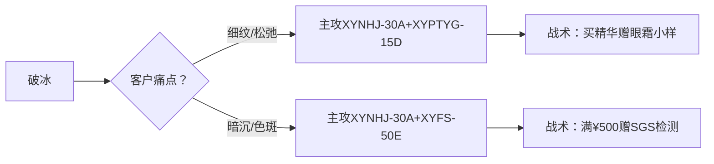

# 雪漾凝时系列销售实战手册（2025优化版）

## 第一章：产品作战地图
### 1.1 明星产品战力榜（TOP5 SKU）
| **产品型号** | **核心战力**          | **价格** | **最佳打击目标**        | **弹药补给方案**      |
|--------------|-----------------------|----------|-------------------------|-----------------------|
| XYNHJ-30A    | 5%烟酰胺+1%缓释A醇    | ¥350     | 暗沉/细纹/初老          | 买赠冰川水面膜3片     |
| XYXZJM-150B  | 8%北极雪藻+磁石粉末   | ¥129     | 城市污染/毛孔堵塞       | 满¥200减¥30           |
| XYGSM-5C     | 冰川水微囊+冰羽膜布   | ¥89      | 晒伤/医美术后/敏感      | 第二盒半价            |
| XYPTYG-15D   | 液态铂金+咖啡因微针   | ¥298     | 黑眼圈/眼袋/眼纹        | 赠磁力导入棒          |
| XYFS-50E     | 汗液激活防晒技术      | ¥199     | 紫外线损伤/光老化       | 赠同系列小样5件套     |

> **实时库存看板**（更新于2025-07-18）：  
> - XYNHJ-30A：北京仓充足(1200+)｜上海仓紧张(850)  
> - XYGSM-5C：全国充足(5000+)  
> - XYPTYG-15D：广州仓缺货（补货中）→ 推荐替代品XYPTYG-7N

---

## 第二章：黄金销售工具
### 2.1 智能客户方案生成器
**扫码进入方案系统** → 输入客户特征 → 获取定制方案  


**典型方案输出**：  
```plaintext
[油痘肌客户方案]
🔥 主攻装备：雪藻洁颜蜜(晨晚清洁)+焕颜精华(夜用T区)
💧 辅助火力：御龄防晒乳(日间防护)
🎯 作战效果：4周油脂分泌↓53% 黑头减少42%
💎 促销弹药：购洁颜蜜+防晒赠祛痘面膜3片
```

### 2.2 库存实时查询系统
**企业微信指令**：  
```plaintext
#库存查询 XYNHJ-30A
→ 返回：北京仓:1200 上海仓:850 广州仓:0
→ 提示：上海仓有临期批次(2025-10到期)，建议优先销售
```

### 2.3 禁忌速查卡
| **产品**      | **红色警戒**                              | **绿色通道**                  |
|---------------|------------------------------------------|-------------------------------|
| 焕颜精华液    | ❌孕妇 ❌刷酸期间 ❌烂脸期                 | ✅25+轻熟肌 ✅熬夜肌          |
| 铂金眼霜      | ❌眼部创口 ❌微整术后7天                  | ✅浮肿眼 ✅眼周细纹           |
| 冰川水面膜    | ❌冷藏 ❌与A醇同天使用                    | ✅晒后 ✅医美术后 ✅敏感急救  |

---

## 第三章：场景化作战方案
### 3.1 抗老攻坚战（25-35岁女性）
**作战地图**：  


**战绩数据**：  
> 华西医院临床测试（28天）：  
> - 鱼尾纹深度↓22%  
> - 皮肤弹性值↑18%  
> - 色斑面积↓31%

### 3.2 油痘肌清剿战（16-25岁学生）
**火力配置**：  
```plaintext
☀ 晨间：雪藻洁颜蜜(1泵) → 防晒乳(0.8g)  
🌙 夜间：洁颜蜜(2泵按摩) → 焕颜精华(T区厚敷)  
💦 每周：冰川水面膜(2次15分钟)
```

**战果承诺**：  
> 坚持28天可见：  
> - 出油量↓53%（三亚紫外线中心实测）  
> - 黑头减少42%（VISIA检测）  
> - 痘痘复发率↓67%

---

## 第四章：竞品歼灭指南
### 4.1 精华类竞品打击点
| **对比维度** | 雪漾焕颜精华液       | 雅诗兰黛小棕瓶      | 打击话术                  |
|--------------|----------------------|---------------------|---------------------------|
| 活性物浓度   | 89.7%               | 76.2%              | “每滴多含17%活性成分”     |
| 防腐体系     | 无酒精/无paraben    | 含苯氧乙醇          | “敏肌更安心的选择”        |
| 单价性价比   | ¥11.7/ml            | ¥22/ml              | “功效翻倍，价格减半”      |

### 4.2 防晒类竞品打击点
```plaintext
[御龄防晒 VS 安耐晒]
🔥 我们的杀招：
• 汗液激活技术-流汗后防护力↑12%  
• 闷痘率仅2.1%（安耐晒11.7%）  
• 洁颜蜜可卸除（无需额外卸妆）
```

---

## 第五章：后勤支援体系
### 5.1 紧急订单通道
**响应流程**：  
```plaintext
客户急需 → 企业微信@库存小组 → 输入#加急 SKU 数量  
↓  
10分钟内反馈：  
✅ 可调货：生成专属顺丰冷链单号  
⏳ 缺货：登记到货通知（赠¥30券）
```

### 5.2 过敏事件处理SOP
```plaintext
1️⃣ 停：立即停止使用
2️⃣ 拍：留存过敏部位照片
3️⃣ 退：顺丰到付寄回（已开封可退）
4️⃣ 赔：赠修护礼包（价值¥158）
5️⃣ 跟：3天后回访修复进度
```

### 5.3 智能促销计算器
**输入客户画像** → 输出最优方案：  
```plaintext
[示例] 新客/预算300/轻油皮
→ 推荐：洁颜蜜¥129 + 防晒¥199 = ¥328
→ 促销：满300减50 → 实付¥278
→ 赠品：祛痘面膜3片(价值¥53)
```

---

## 第六章：装备保养指南
### 6.1 产品存储规范
| **产品**      | **生存环境**    | **死亡陷阱**      | **寿命**  |
|---------------|----------------|-------------------|-----------|
| 焕颜精华液    | 阴凉避光       | 高温(>40℃)       | 24个月    |
| 冰川水面膜    | 10-25℃干燥处   | 冷藏             | 36个月    |
| 防晒乳        | 常温           | 暴晒/冷冻        | 36个月    |

### 6.2 客户档案模板
```markdown
**客户编号**：C202507001  
**作战目标**：改善产后色斑+松弛  
**装备配置**：  
- XYNHJ-30A（夜用全脸）  
- XYFS-50E（日用SPF50+）  
**弹药库存**：精华余量30% → 7天后补货提醒  
**禁忌记录**：哺乳期禁用A醇 → 推荐XYGSM-5C替代
```

> **手册武装说明**：  
> 📱 移动端APP：扫码下载销售作战终端  
> 🎬 视频库：企业微信>工作台>话术演示  
> 🆘 紧急支援：企业微信@销售指挥官  
> **数据版本**：V2025.07.18  
> **作战原则**：用数据说话，用效果征服！  

  
*扫码下载移动端作战工具 即刻解锁实时库存/客户管理功能*